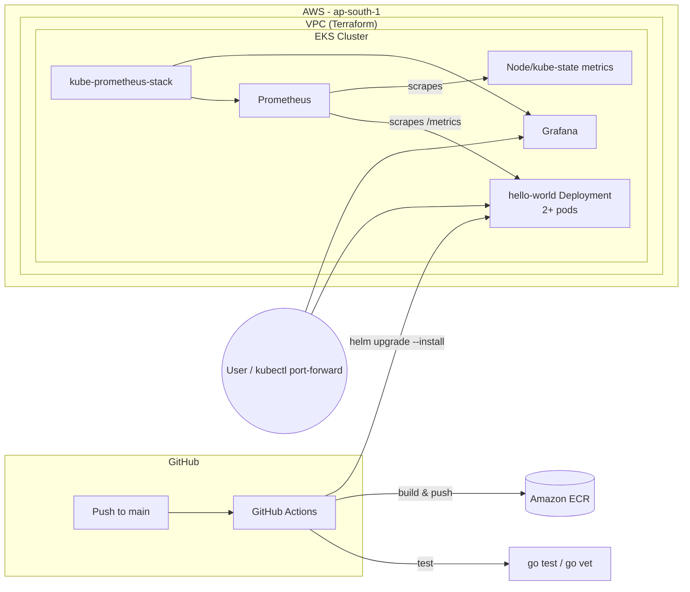

# Lucidity DevOps Take-Home Assignment — Hello World on EKS

A production-style walkthrough of provisioning an Amazon EKS cluster with Terraform, deploying a Go
"Hello World" microservice via a Helm chart, and monitoring both the application and the cluster with
Prometheus and Grafana. A GitHub Actions pipeline automates build → push → deploy on every push to `main`.

## Architecture



**Flow:** Terraform provisions the VPC + EKS cluster and managed node group → the Go service is
containerized and pushed to ECR → Helm deploys it to the cluster with liveness/readiness probes and a
`ServiceMonitor` → kube-prometheus-stack (Prometheus + Grafana + Alertmanager) auto-discovers the service
via the ServiceMonitor and scrapes both the app's custom metrics and standard cluster/node metrics.

## Repository structure

```
lucidity-devops-assignment/
├── app/                          # Go "Hello World" microservice
│   ├── main.go                   # HTTP server: /, /health, /ready, /metrics
│   ├── main_test.go              # Unit tests
│   ├── go.mod
│   └── Dockerfile                # Multi-stage build -> distroless runtime image
│
├── terraform/                    # Infrastructure as Code (EKS on AWS)
│   ├── providers.tf              # AWS/Kubernetes/Helm provider config
│   ├── variables.tf              # Input variables (region, cluster name, sizing...)
│   ├── vpc.tf                    # VPC module (public/private subnets, NAT)
│   ├── eks.tf                    # EKS cluster + managed node group + addons
│   ├── outputs.tf                # cluster name, endpoint, kubectl config command
│   └── terraform.tfvars.example  # Copy to terraform.tfvars and customize
│
├── helm/hello-world/             # Helm chart for the microservice
│   ├── Chart.yaml
│   ├── values.yaml               # Image, resources, probes, autoscaling, ServiceMonitor
│   └── templates/
│       ├── deployment.yaml
│       ├── service.yaml          # ClusterIP (+ optional LoadBalancer)
│       ├── hpa.yaml              # Optional HorizontalPodAutoscaler
│       ├── servicemonitor.yaml   # Wires the app into Prometheus
│       ├── _helpers.tpl
│       └── NOTES.txt
│
├── monitoring/                   # Prometheus + Grafana setup
│   ├── kube-prometheus-stack-values.yaml   # Helm values for the monitoring stack
│   ├── grafana-dashboard-configmap.yaml    # Auto-loads the custom dashboard into Grafana
│   └── grafana-dashboards/
│       └── hello-world-dashboard.json      # Request rate, latency, errors, CPU/memory, restarts
│
├── scripts/
│   ├── deploy.sh                 # One-shot build -> push -> helm deploy
│   └── install-monitoring.sh     # Installs kube-prometheus-stack + dashboard
│
├── .github/workflows/ci-cd.yaml  # CI/CD: test -> build & push to ECR -> deploy via Helm
├── .gitignore
└── README.md
```

## Prerequisites

- AWS account with credentials configured (`aws configure`), permissions to create VPCs, EKS clusters,
  IAM roles, and ECR repositories
- [Terraform](https://developer.hashicorp.com/terraform/downloads) >= 1.6
- [AWS CLI](https://docs.aws.amazon.com/cli/latest/userguide/getting-started-install.html) v2
- [kubectl](https://kubernetes.io/docs/tasks/tools/)
- [Helm](https://helm.sh/docs/intro/install/) >= 3.14
- [Docker](https://docs.docker.com/get-docker/)
- Go 1.22+ (only needed if you want to run/test the service locally outside Docker)

> **Cost note:** This provisions real AWS resources (EKS control plane, EC2 worker nodes, NAT gateway,
> EBS volumes). Expect roughly $0.10/hr for the EKS control plane plus EC2/NAT costs. **Remember to run
> the teardown steps below when you're done** to avoid ongoing charges.

## Step-by-step: run it end-to-end

### 1. Provision the EKS cluster with Terraform

```bash
cd terraform
cp terraform.tfvars.example terraform.tfvars   # edit values if needed (region, cluster name, sizing)
terraform init
terraform plan
terraform apply    # ~12-15 minutes, mostly waiting on the EKS control plane
```

Once complete, point `kubectl` at the new cluster:

```bash
$(terraform output -raw configure_kubectl)
kubectl get nodes    # should show your worker nodes as Ready
```

### 2. Build, push, and deploy the microservice

The `scripts/deploy.sh` helper does this in one shot (builds the Docker image, creates the ECR repo if
needed, pushes the image, and runs `helm upgrade --install`):

```bash
cd ..   # back to repo root
export AWS_REGION=ap-south-1   # match what you set in terraform.tfvars
./scripts/deploy.sh
```

Or run the steps manually:

```bash
# Build & push
ACCOUNT_ID=$(aws sts get-caller-identity --query Account --output text)
aws ecr create-repository --repository-name lucidity-hello-world --region ap-south-1
aws ecr get-login-password --region ap-south-1 | docker login --username AWS --password-stdin $ACCOUNT_ID.dkr.ecr.ap-south-1.amazonaws.com
docker build -t $ACCOUNT_ID.dkr.ecr.ap-south-1.amazonaws.com/lucidity-hello-world:latest ./app
docker push $ACCOUNT_ID.dkr.ecr.ap-south-1.amazonaws.com/lucidity-hello-world:latest

# Deploy
helm upgrade --install hello-world ./helm/hello-world \
  --set image.repository=$ACCOUNT_ID.dkr.ecr.ap-south-1.amazonaws.com/lucidity-hello-world \
  --set image.tag=latest
```

### 3. Verify the Hello World endpoint

```bash
kubectl port-forward svc/hello-world 8080:80
```

In another terminal:

```bash
curl http://localhost:8080/
# -> Hello World

curl http://localhost:8080/health
# -> {"status":"ok"}

curl http://localhost:8080/metrics
# -> Prometheus metrics, including hello_world_http_requests_total
```

### 4. Install Prometheus + Grafana

```bash
./scripts/install-monitoring.sh
```

This installs `kube-prometheus-stack` (Prometheus, Alertmanager, Grafana, node-exporter,
kube-state-metrics) into the `monitoring` namespace and loads a custom dashboard for the Hello World
service.

Access Grafana:

```bash
kubectl port-forward -n monitoring svc/kube-prometheus-stack-grafana 3000:80
# open http://localhost:3000  (user: admin / password: admin123 — change this for anything beyond a demo)
```

Access Prometheus directly:

```bash
kubectl port-forward -n monitoring svc/kube-prometheus-stack-prometheus 9090:9090
# open http://localhost:9090 and query e.g. hello_world_http_requests_total
```

In Grafana, the **"Hello World Service - Overview"** dashboard shows request rate, p95 latency, error
rate, and pod CPU/memory/restarts. The stack also ships Grafana's default Kubernetes cluster dashboards
(nodes, namespaces, pods) out of the box.

### 5. (Optional) CI/CD via GitHub Actions

`.github/workflows/ci-cd.yaml` runs on every push to `main`: tests the Go service, builds and pushes the
Docker image to ECR, then deploys via Helm. To use it, add these repository secrets:

| Secret                  | Description                                          |
| ----------------------- | ---------------------------------------------------- |
| `AWS_ACCESS_KEY_ID`     | IAM user/role with ECR + EKS deploy permissions      |
| `AWS_SECRET_ACCESS_KEY` | Matching secret key                                  |
| `ECR_REGISTRY`          | e.g. `123456789012.dkr.ecr.ap-south-1.amazonaws.com` |

For production use, prefer OIDC federation (`aws-actions/configure-aws-credentials` with a role ARN)
over long-lived access keys — noted as a known limitation below.

### 6. Tear everything down

```bash
helm uninstall kube-prometheus-stack -n monitoring
kubectl delete namespace monitoring
helm uninstall hello-world
cd terraform
terraform destroy
```

Also delete the ECR repository and any images if you no longer need them.

## Design decisions

- **Go** for the microservice: compiles to a static binary, runs on a minimal `distroless` base image
  (small attack surface, fast startup — a good fit for Kubernetes), and it's the native language of the
  Kubernetes ecosystem itself.
- **terraform-aws-modules/eks** and **terraform-aws-modules/vpc**: battle-tested community modules
  instead of hand-rolled resources, which is what most teams use in practice and keeps the Terraform
  focused on configuration rather than reinventing EKS networking/IAM plumbing.
- **kube-prometheus-stack**: the de-facto standard way to get Prometheus + Grafana + Alertmanager +
  node/kube-state metrics running on Kubernetes with one Helm install, rather than wiring up each
  component by hand.
- **ServiceMonitor** (Prometheus Operator CRD) instead of static scrape configs: lets Prometheus
  auto-discover the app the moment it's deployed, which is how monitoring is typically wired up
  alongside app deployments in a GitOps/Helm-based workflow.
- **Distroless + non-root container**: no shell, no package manager, runs as a non-root user — reduces
  the image's attack surface for a public-facing service.

## Known limitations / notes for the reviewer

- `go.sum` is intentionally not committed as-is here since it was generated without network access in
  this environment — run `go mod tidy` once inside `app/` on a machine with internet access before your
  first build; it will generate a correct `go.sum` from `go.mod`. CI will do this automatically via
  `go mod download`.
- The GitHub Actions workflow uses long-lived AWS access-key secrets for simplicity. In a real production
  setup I'd switch to short-lived credentials via GitHub's OIDC provider and an IAM role trust policy.
- Grafana's admin password in `monitoring/kube-prometheus-stack-values.yaml` is a placeholder
  (`admin123`) — fine for this local/demo exercise, but should come from a Kubernetes Secret or a secrets
  manager in production.
- The `LoadBalancer` Service for the app is disabled by default (`loadBalancer.enabled: false` in
  `values.yaml`) to avoid provisioning a billable public AWS ELB just to view "Hello World" — the README
  uses `kubectl port-forward` instead. Flip it to `true` (`--set loadBalancer.enabled=true`) if you want a
  public endpoint.
- No Ingress controller / TLS is set up, since the assignment only asks for an HTTP endpoint exposed
  within the cluster. Adding an ALB Ingress Controller + ACM certificate would be the natural next step
  for a real internet-facing service.
- `single_nat_gateway = true` by default to keep cost down for a demo cluster; set it to `false` in
  `terraform.tfvars` for a highly-available multi-AZ NAT setup.
- Terraform state is local by default (no S3 backend configured) so the project runs without any
  pre-existing infrastructure. The `backend "s3"` block in `terraform/providers.tf` is ready to uncomment
  for a shared/remote state setup.

## Testing the Go service locally (without Kubernetes)

```bash
cd app
go mod tidy
go run main.go
# in another terminal
curl http://localhost:8080/
```
